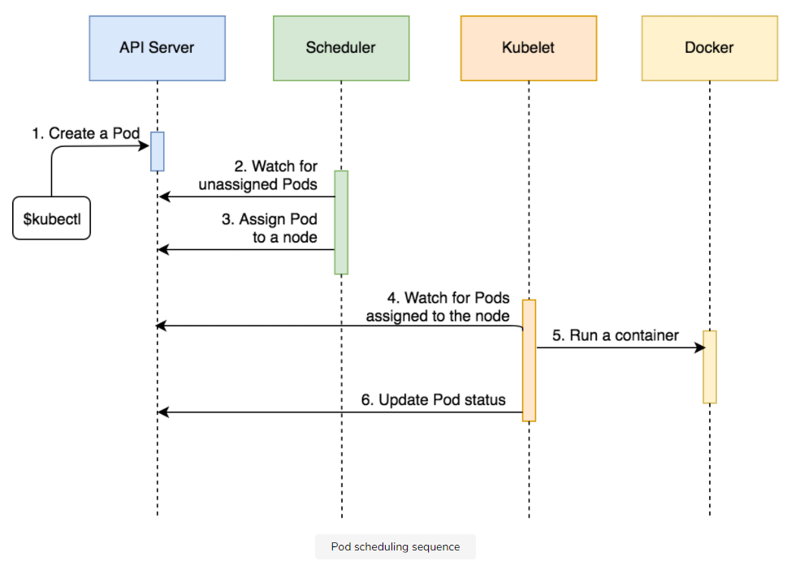

# Pods

## Components involved in a Pod's Scheduling

**Three** major components were involved in the process:

### 1. API Server

The _API server_ is the central component of a Kubernetes cluster and it runs on the master node. All other components interact with API server and keep watch for changes. Most of the coordination in Kubernetes consists of a component writing to the API Server resource that another component is watching. The second component will then react to changes almost immediately.

### 2. Scheduler

The _scheduler_ is also running on the master node. Its job is to watch for unassigned pods and assign them to a node which has available resources (CPU and memory) matching Pod requirements.

### 3. Kubelet

_Kubelet_ runs on each node. Its primary function is to make sure that assigned pods are running on the node. It watches for any new Pod assignments for the node. If a Pod is assigned to the node Kubelet is running on, it will pull the Pod definition and use it to create containers through Docker or any other supported container engine.

## Sequential Breakdown of Events

The sequence of events that transpired with the kubectl create -f pod/db.yml command is as follows:

1. Kubernetes client (`kubectl`) sent a request to the API server requesting creation of a Pod defined in the `pod/db.yml` file.
2. Since the scheduler is watching the API server for new events, it detected that there is an unassigned Pod.
3. The scheduler decided which node to assign the Pod to and sent that information to the API server.
4. Kubelet is also watching the API server. It detected that the Pod was assigned to the node it is running on.
5. Kubelet sent a request to Docker requesting the creation of the containers that form the Pod. In our case, the Pod defines a single container based on the `mongo` image.
6. Finally, Kubelet sent a request to the API server notifying it that the Pod was created successfully.

The process might not make much sense right now since we are running a single-node cluster. If we had more VMs, scheduling might have happened somewhere else, and the complexity of the process would be easier to grasp.

The following illustration shows a Pod’s scheduling sequence:

